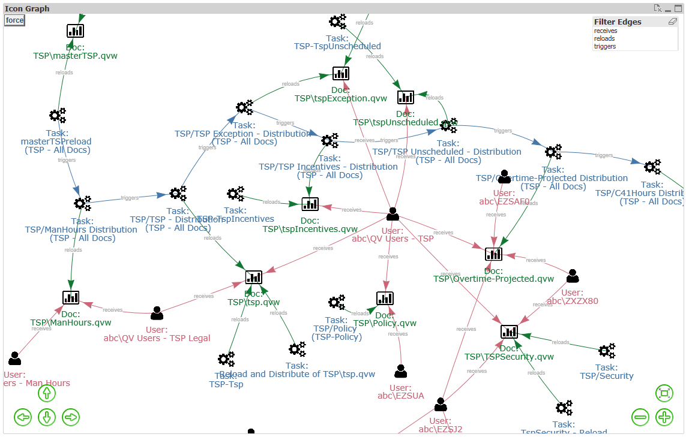
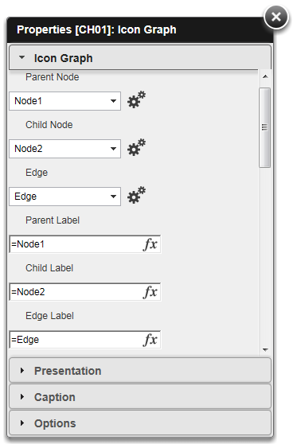

QlikView Extension IconGraph
============================

Icon Graph Visualization Extension Object for QlikView based on Vis.js network view: http://www.visjs.org/

As an introduction into graphs take a look here: http://en.wikipedia.org/wiki/Graph_theory

This extension uses images from flaticon.com but you can also use your own images. Images are located in subfolder ./img

License and attribution:
Font generated by <a href="http://www.flaticon.com">flaticon.com</a>
 under <a href="http://creativecommons.org/licenses/by/3.0/">CC BY</a>. The authors are: <a href="http://fontawesome.io">Dave Gandy</a>.

Properties:
-----------
The underlaying data table of the extension (straight table chart) needs to represent a graph as an adjacancy list where each row represents an edge with a starting node and end node (or vertex): http://en.wikipedia.org/wiki/Adjacency_list
Images are assigned to node types. Node types must be encoded into the node's name as a prefix like this: "NodeType:NodeName"

1. Parent Node        : field name for starting node name (dimension)
2. Child Node         : field name for end node name (dimension)
3. Edge               : field name for edge type (dimension, useful for filtering and probably later used for selections, no display)
4. Parent Labe l      : expression for starting node label (measure, used as label under the node)
5. Child Label        : expression for end node label (measure, used as label under the node)
6. Edge Label         : expression for edge type label (measure, used as popup)
7. Parent Size        : expression for node size (measure, not implemented yet)
8. Child Size         : expression for node size (measure, not implemented yet)
9. Edge Color         : expression for color of edge line (measure, possible values: 'darkgray', '#117733', etc.)
10. Parent Tooltip    : expression for node tooltip (measure, displayed on hover)
11. Child Tooltip     : expression for node tooltip (measure, displayed on hover)
12. Edge Tooltip      : expression for edge tooltip (measure, displayed on hover)
13. Node Type Prefixes: comma separated list of prefixes (property)
13. Node Type Colors  : comma separated list of color codes (property)
13. Node Type Images  : comma separated list of image file names (property)
14. Graph is directed : if true, all edges are drawn, if false, edges connecting same nodes are aggregated, then better use "line" as style, not "arrow" (property, default=true)
15. Edge Style        : line style of the edges (property, possibe values: line, arrow (default), arrow-center, dash-line)
16. Edge Label Color  : color of the label drawn on edge line (property, default="darkgray", overwritten by Edge Color expression)
17. Edge Font Size    : size of the font used for edge label, should be rather small (property, default=9)

Sample Application QVPR Graph:
------------------------------

Rob Wunderlich (http://qlikviewcookbook.com) provides this QlikView application:
QVPR Analysis is a tool that will load a Qlikview Repository (QVPR) and allow you to analyze the contents. 
With this app you can do Qlikview Analysis of the Reload and Distribution tasks defined on your server.

As an addition to it I created a QlikView application which binary loads QvprAnalysis.qvw and additionally loads some aspects(docs, tasks, users) into an adjacency list table to display it as a graph.

